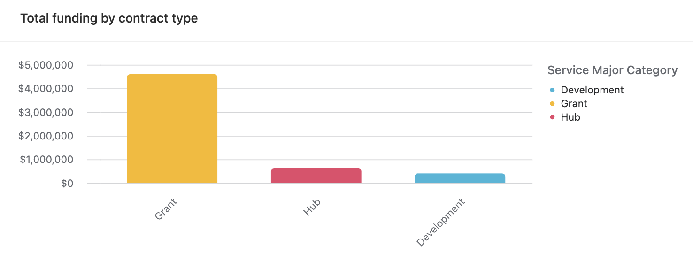
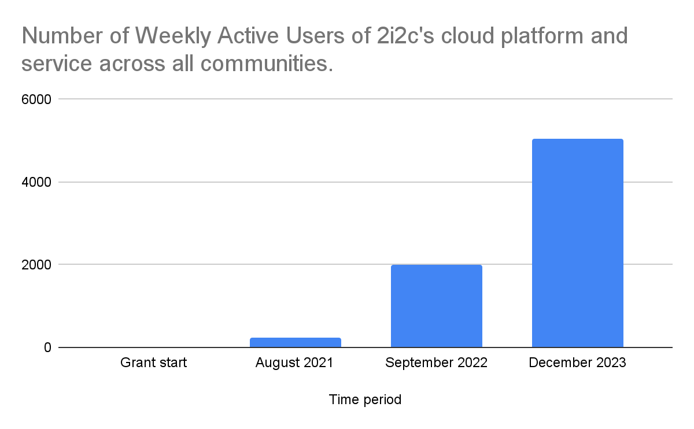
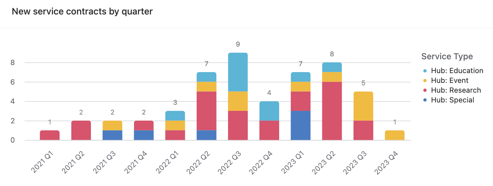
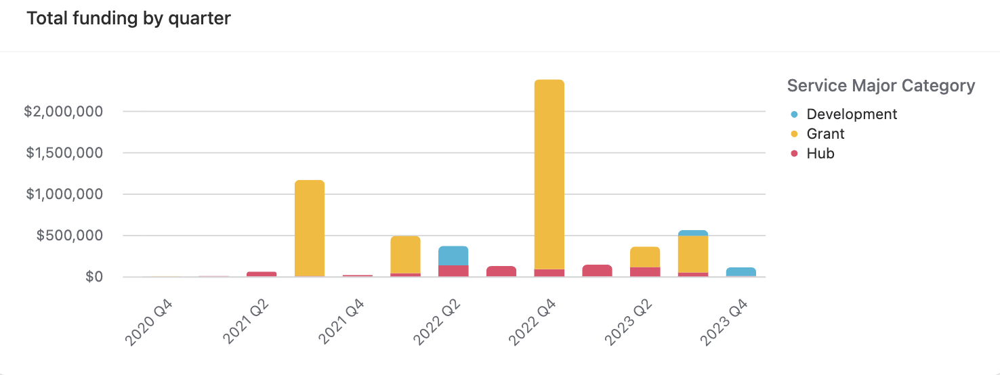
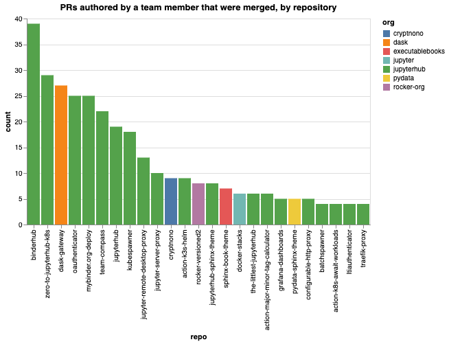
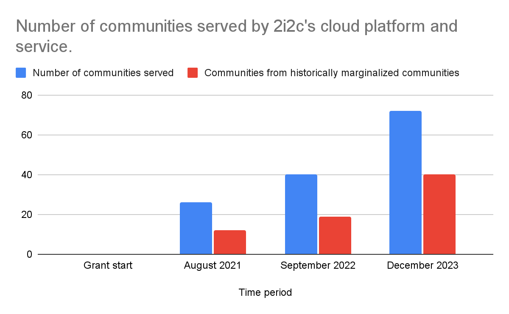

# 2i2c grant report for core CZI funding

2i2c is now three years old, having been initially founded with this grant from CZI in late 2020. Over this time, 2i2c has grown and matured as an organization, has served thousands of users doing open science and education, and has made extensive contributions to the open source ecosystem for interactive computing.

This document contains a brief overview of over these three years, as well as a detailed overview of the final year of the grant. It is broken down into three key areas of organizational impact.

## Impact through our cloud platform and service

2i2c aims to provide a community-centric platform that enables the lifecycle of knowledge creation and sharing. At the heart of this model is a community JupyterHub that provides a digital space where many community members come together to access shared resources and work together[^communities]. For a more in-depth picture of community hubs see our [Community Hubs Usage Dashboard](https://2i2c.org/kpis/cloud/).

[^communities]: “Communities” are a combination of research groups, classrooms, communities of practice, and institutions that were actively using the service at the end of each date period. Historically marginalized communities are defined as educational institutions that are not R1 universities (for example, community colleges) as well as communities that are primarily not based in North America or Western Europe.

The most direct measure of impact for 2i2c is in the number and diversity of communities that utilize our service. At the time of writing, our open science cloud platform serves more than **70 different communities**, at a total of around **7200 monthly active users**.

Below we show the total number of communities served on our platform each year, with a focus on historically marginalized communities.

In addition we track **Weekly Active Users** across all communities to understand how frequently community members make use of the platform[^wau]. Below we show an estimate of Weekly Active Users at the end of each year of this grant.

[^wau]: This is defined as a user that starts their own Jupyter server within a week-long window. Note that this varies heavily based on the academic calendar, and spikes around the end of each academic semester.

These communities are intentionally diverse in their scope and focus, and range from university-wide educational services ([University of Toronto](jupyter.utoronto.ca)), to multi-organization research collaborations (the [LEAP project at Columbia University](https://leap.columbia.edu/)), to major federal projects fighting climate change (the [US Greenhouse Gas Center](https://earth.gov/ghgcenter)), to networks of community colleges in California (the [CloudBank and UC Berkeley educational hubs collaboration](https://www.cloudbank.org/training/cloudbank-educators)), to international networks of historically under-resourced communities in the Global South (the [CZI-funded Catalyst Project](https://catalystproject.cloud/)). 

These numbers are beyond the expectations that we had for 2i2c when we first began this service, and speak to the value of open science platforms rooted in community-centric design and open infrastructure.

## Capacity building for open source projects

Another key outcome of this grant was using 2i2c as a mechanism to grow capacity in open source ecosystems. 2i2c builds its open science platform by integrating community-driven open source projects. Providing upstream contributions and support to the communities that underlie these projects is a secondary goal that underlies 2i2c’s open practices as an organization. For a more in-depth picture of our upstream contributions, see [our Upstream Contributions Dashboard](https://2i2c.org/kpis/upstream/).

Since January, 2021, 2i2c’s team members have authored over **[2,000 merged pull requests across more than 600 repositories](https://github.com/search?q=author:choldgraf+author:haroldcampbell+author:colliand+author:jmunroe+author:Gman0909+author:AIDEA775+author:consideRatio+author:damianavila+author:georgianaelena+author:sgibson91+author:yuvipanda+org:jupyter+org:jupyter-server+org:jupyterhub+org:jupyterlab+org:binder-examples+org:executablebooks+org:cryptnono+org:dask+org:pydata+org:rocker-org+org:pangeo-data+is:pr+merged:%3E=2020-12-01)** in “key upstream communities” that underlie our infrastructure[^kuc]. For example, here is a summary of merged Pull Requests in key upstream repositories that were authored by a 2i2c team member over the last two quarters:

[^kuc]: A Key Upstream Community is an open source community that builds infrastructure considered strategically critical for 2i2c’s services and impact.

2i2c now **employs 6 “distinguished contributors” to the Jupyter Community**, as well as several team members that create training and guidance programs to help communities use these open source tools to their full potential. We have driven major enhancements to technology in the stack, such as bringing [Binder-like environment building to JupyterHub](https://2i2c.org/blog/2024/jupyterhub-binderhub-gesis/), or [creating a more flexible and powerful user environment selector](https://github.com/yuvipanda/jupyterhub-fancy-profiles), or [defining a new documentation back-end for the Jupyter Book ecosystem](https://executablebooks.org/en/latest/blog/2023/new-project-members/).

We believe that no other organization exists that has served such a diverse collection of community partners in open science workflows while providing entirely open source technology that is driven by multi-stakeholder communities of practice. This highlights our commitment to ensuring these open source communities are healthy.

## Organizational capacity and sustainability

Finally, 2i2c has grown and matured as an organization. We began with a team of **two** (an Executive Director and one Engineer). We are now a team of **twelve**, with organizational capacity split across engineering, community partnerships, product management, and organizational operations and strategy. This more complex structure reflects a more mature organization that understands the roles that are needed in order to deliver excellent open science cloud services to research and education communities. We also believe this model  can serve as a guide for mission-driven organizations that facilitate collaboration between the open science and open source communities.

Over the last three years, 2i2c has brought in **over $5.6 million dollars**(including this grant) to fund the capacity needed to carry out its operations. The majority of our funds have come from direct grants to 2i2c, or grant-funded collaborations with other communities. Over time, we have increased the percentage of our revenue that comes from service contracts, and aim to continue this trend to further diversify our sources of funding.

Below is a graph of 2i2c’s total funding broken down by major category. Note that for several grants, 2i2c was not the sole recipient of funds, but served as the Principal Awardee for the grant.

And the same data broken down by quarter since the beginning of this grant:

Finally, here are the new service contracts in each quarter since the start of this grant. This is a reflection of the revenue-generating partnerships that 2i2c has created.

## Areas for growth and next steps

After three years, 2i2c’s service has demonstrated a clear demand for community-centric science platforms built on open infrastructure, and continues to grow the percentage of costs it recovers from service contracts versus grants. We’ve also identified several challenges to overcome in order to carry the organization forward into its next phase. Below is a brief description of each. 

### Refine our operating and service model

In 2023, our team felt like we hit a ceiling in how quickly we could make strategic progress. The growth of our service, paired with a lack of evolution of our team’s planning mechanisms, led to a lot of reactive work and a lack of alignment on next steps. The organic growth of our service is an excellent indicator that we are delivering value and having an impact. However we also believe that we need a sharper definition of our value proposition, service offering, and pricing/funding model.

To address this, we partnered with an organizational consultant to audit 2i2c’s structure and practices and make recommendations for adjustments. We [published the consultant’s full report at this blog post](https://2i2c.org/blog/2023/organizational-report/). We next turn to implementing the recommendations made in the report, and measuring whether this has had a positive impact on our team, with the goal of **refining our organizational value proposition and operating model**. 

To begin, we’ve created new roles dedicated to overseeing our team’s system of work as well as product strategy and user research. We’ve also invested in People Operations capacity in order to design support and growth plans for our team. We believe this will allow us to make more strategic improvements to our platform and to the upstream communities we support.

### Grow our service and runway through fundraising

As of this writing, we have approximately 11 months of runway remaining. This is within the lower end of our “comfort range”, and the cost of our new hires create a sense of urgency to raise funds for the next phase of 2i2c’s operations. The organizational refinement described above sets up 2i2c for a subsequent phase of growth in the communities that we serve, in order to cover these new costs. 

We are currently exploring a combination of grants, donations, and service contracts, with a goal of extending our runway by another three years. Once we make the necessary adjustments to improve our operating model described above, we will next focus on this goal to ensure that 2i2c may continue to provide value to open science communities across the world. By improving our value proposition, product, and service operations, we will improve our chances of bringing in funding to extend our organizational runway and move us closer towards long-term sustainability.

## Acknowledgements

2i2c’s success would not be possible without the critical support it received from CZI at its founding. The capacity provided by this grant was a crucial moment in crystallizing the vision of 2i2c and taking our first steps as an organization. We are honored to have had this chance to build an impactful, open, and ambitious organization like 2i2c, and we’re excited about the next step in our organization’s journey.

